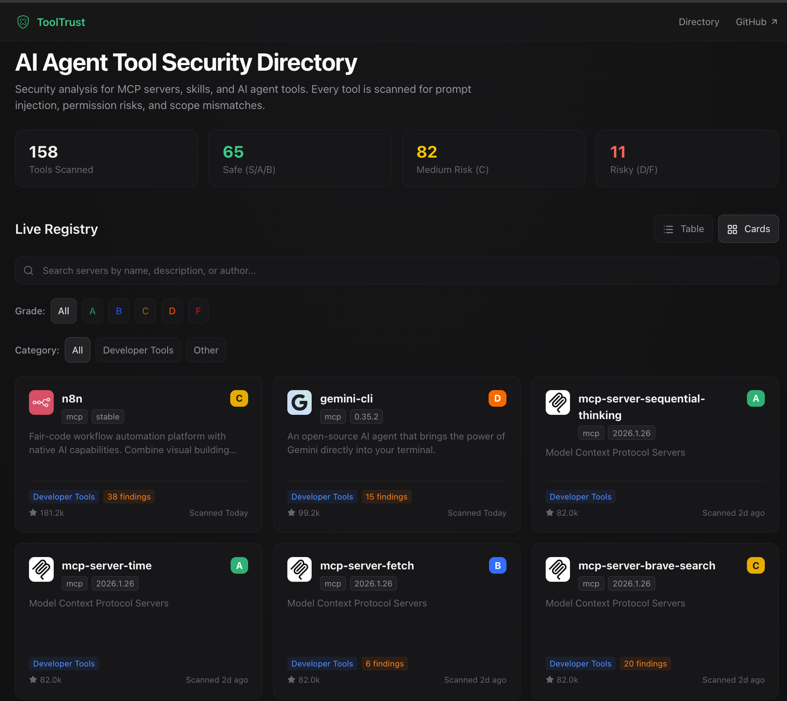

# 🛡️ ToolTrust Directory

> **This repo hosts [tooltrust.dev](https://www.tooltrust.dev/) — the website and pre-scanned report data. If you want to scan your own MCP servers, go to [tooltrust-scanner](https://github.com/AgentSafe-AI/tooltrust-scanner).**

A public registry of AI agent tools, continuously scanned for prompt injection, data exfiltration, and privilege escalation by [ToolTrust Scanner](https://github.com/AgentSafe-AI/tooltrust-scanner).

> **🚨 Supply-Chain Incident Coverage (March 2026)**
> ToolTrust now detects and blocks confirmed supply-chain incidents including the LiteLLM / TeamPCP compromise and the malicious axios npm publish (`axios@1.14.1`, `axios@0.30.4`). For npm-backed MCP servers, ToolTrust also scores dependency visibility, transitive lockfile evidence, lifecycle scripts, and IOC indicators such as `plain-crypto-js`.



[](./data/reports/)
[](./data/reports/)
[](./LICENSE)
[](./report.schema.json)

---

## 📊 Security Registry

<!-- TOOLTRUST:BEGIN -- Do not edit this section manually. -->

*Top 50 by popularity. View all 1852 tools → [Full Directory](./docs/full-directory.md) · [data/reports/](./data/reports/) · [docs/tools/](./docs/tools/)*

| Tool | Version | Popularity | Grade | Key Findings | Scanned |
|------|---------|:-----:|:-----:|:-------------|:-------:|
| [typescript-sdk](https://github.com/modelcontextprotocol/typescript-sdk) | `2.0.0-beta.1` | 209.3M/mo | **[A](./docs/tools/typescript-sdk.md)** | `AS-014` | Aug 28 |
| [playwright-mcp](https://github.com/microsoft/playwright-mcp) | `0.0.79` | 25.4M/mo | **[C](./docs/tools/playwright-mcp.md)** | `AS-014` ×24, 🔑 `AS-002` ×11, ⚡ `AS-006` ×2, ⚡ `AS-011` ×5 | Aug 28 |
| [ext-apps](https://github.com/modelcontextprotocol/ext-apps) | `1.7.5` | 12.8M/mo | **[A](./docs/tools/ext-apps.md)** | 🔑 `AS-002`, `AS-014` ×3 | Aug 28 |
| [chrome-devtools-mcp](https://github.com/ChromeDevTools/chrome-devtools-mcp) | `chrome-dev…` | 9.5M/mo | **[C](./docs/tools/chrome-devtools-mcp.md)** | `AS-014` ×29, 🔑 `AS-002` ×13, ⚡ `AS-011` ×4, ⚡ `AS-006` | Aug 28 |
| [context7](https://github.com/upstash/context7) | `1.0.30` | 3.9M/mo | **[A](./docs/tools/context7.md)** | `AS-014` ×2, 🔑 `AS-002`, ⚡ `AS-011` | Aug 28 |
| [upstash-context7-mcp](https://github.com/upstash/context7) | `1.0.30` | 3.4M/mo | **[A](./docs/tools/upstash-context7-mcp.md)** | `AS-014` ×2, 🔑 `AS-002`, ⚡ `AS-011` | Jul 17 |
| [mcp-server-filesystem](https://github.com/modelcontextprotocol/servers/tree/main/src/filesystem) | `typescript…` | 2.2M/mo | **[A](./docs/tools/mcp-server-filesystem.md)** | 🔑 `AS-002` ×14, `AS-014` ×14, ⚡ `AS-011` | Aug 28 |
| [editor](https://github.com/pascalorg/editor) | `1.0.0-beta.1` | 1.8M/mo | **[A](./docs/tools/editor.md)** | 🔑 `AS-002` ×2, ⚡ `AS-011` ×2, `AS-014` ×5 | Aug 28 |
| [gemini-cli](https://github.com/google-gemini/gemini-cli) | `0.59.0-nig…` | 1.7M/mo | **[A](./docs/tools/gemini-cli.md)** | `AS-014` ×56, 🔑 `AS-002` ×23, ⚡ `AS-011` ×11 | Aug 28 |
| [cloudflare-containers](https://github.com/cloudflare/containers) | `0.3.2` | 1.6M/mo | **[A](./docs/tools/cloudflare-containers.md)** | 🔑 `AS-002` ×5, ⚡ `AS-011`, `AS-014` ×7 | Jun 22 |
| [inspector](https://github.com/modelcontextprotocol/inspector) | `2-alpha-15` | 1.0M/mo | **[A](./docs/tools/inspector.md)** | `AS-014` ×2 | Aug 28 |
| [notion-mcp-server](https://github.com/makenotion/notion-mcp-server) | `2.5.0` | 733.9k/mo | **[A](./docs/tools/notion-mcp-server.md)** | 🔑 `AS-002` ×24, ⚡ `AS-011` ×24, `AS-014` ×24 | Aug 28 |
| [xcodebuildmcp](https://github.com/getsentry/XcodeBuildMCP) | `2.7.0` | 612.4k/mo | **[A](./docs/tools/xcodebuildmcp.md)** | `AS-014` ×71, 🔑 `AS-002` ×31, ⚡ `AS-011` ×3 | Aug 28 |
| [n8n-mcp](https://github.com/czlonkowski/n8n-mcp) | `2.74.1` | 592.9k/mo | **[A](./docs/tools/n8n-mcp.md)** | `AS-014` ×23, 🔑 `AS-002` ×8, ⚡ `AS-011` ×4 | Aug 28 |
| [agent-device](https://github.com/callstack/agent-device) | `0.20.10` | 570.0k/mo | **[B](./docs/tools/agent-device.md)** | `AS-012`, 🔑 `AS-002` ×8, ⚡ `AS-011` ×6, `AS-014` ×11 | Aug 28 |
| [mcp-server-github](https://github.com/modelcontextprotocol/servers/tree/main/src/github) | `typescript…` | 510.2k/mo | **[A](./docs/tools/mcp-server-github.md)** | 🔑 `AS-002` ×24, `AS-014` ×26, ⚡ `AS-011` ×18 | Aug 28 |
| [mcp-server-sequential-thinking](https://github.com/modelcontextprotocol/servers/tree/main/src/sequentialthinking) | `typescript…` | 507.1k/mo | **[A](./docs/tools/mcp-server-sequential-thinking.md)** | `AS-014` | Aug 28 |
| [firecrawl-mcp-server](https://github.com/firecrawl/firecrawl-mcp-server) | `3.24.1` | 492.7k/mo | **[A](./docs/tools/firecrawl-mcp-server.md)** | 🔑 `AS-002` ×30, ⚡ `AS-011` ×24, `AS-014` ×25 | Aug 28 |
| [cameroncooke-xcodebuildmcp](https://github.com/getsentry/XcodeBuildMCP) | `2.3.2` | 468.8k/mo | **[A](./docs/tools/cameroncooke-xcodebuildmcp.md)** | `AS-014` ×71, 🔑 `AS-002` ×31, ⚡ `AS-011` ×3 | Jun 22 |
| [azure-devops-mcp](https://github.com/microsoft/azure-devops-mcp) | `2.9.0` | 467.2k/mo | **[A](./docs/tools/azure-devops-mcp.md)** | `AS-014` ×9, 🔑 `AS-002`, ⚡ `AS-011` | Aug 28 |
| [figma-context-mcp](https://github.com/GLips/Figma-Context-MCP) | `0.13.2` | 350.0k/mo | **[B](./docs/tools/figma-context-mcp.md)** | `AS-012`, `AS-014` ×9, 🔑 `AS-002`, ⚡ `AS-011` | Aug 28 |
| [qwen-code](https://github.com/QwenLM/qwen-code) | `weaken-too…` | 287.6k/mo | **[A](./docs/tools/qwen-code.md)** | `AS-014` ×28, 🔑 `AS-002`, ⚡ `AS-011` | Aug 28 |
| [mcpb](https://github.com/modelcontextprotocol/mcpb) | `2.1.2` | 248.9k/mo | **[C](./docs/tools/mcpb.md)** | 🔑 `AS-002` ×2, ⚡ `AS-011` ×2, `AS-014` ×10, ⚡ `AS-006` | Aug 28 |
| [mcp-framework](https://github.com/QuantGeekDev/mcp-framework) | `mcp-framew…` | 248.4k/mo | **[A](./docs/tools/mcp-framework.md)** | `AS-014` ×3, 🔑 `AS-002` ×2, ⚡ `AS-011` | Aug 10 |
| [desktopcommandermcp](https://github.com/wonderwhy-er/DesktopCommanderMCP) | `0.2.47` | 228.4k/mo | **[B](./docs/tools/desktopcommandermcp.md)** | 🔑 `AS-002` ×19, `AS-014` ×26, ⚡ `AS-011` ×8, 📐 `AS-003` | Aug 28 |
| [tavily-ai-tavily-mcp](https://github.com/tavily-ai/tavily-mcp) | `0.2.19` | 178.6k/mo | **[A](./docs/tools/tavily-ai-tavily-mcp.md)** | 🔑 `AS-002` ×7, ⚡ `AS-011` ×5, `AS-014` ×5 | Jun 22 |
| [ms-365-mcp-server](https://github.com/Softeria/ms-365-mcp-server) | `0.146.2` | 177.0k/mo | **[A](./docs/tools/ms-365-mcp-server.md)** | `AS-014` ×188, 🔑 `AS-002` ×229, ⚡ `AS-011` ×182 | Aug 28 |
| [magic-mcp](https://github.com/21st-dev/magic-mcp) | `0.2.2` | 166.5k/mo | **[A](./docs/tools/magic-mcp.md)** | `AS-014` ×43, 🔑 `AS-002` ×42, ⚡ `AS-011` ×36, ⚡ `AS-006` | Aug 28 |
| [mcp-server-circleci](https://github.com/CircleCI-Public/mcp-server-circleci) | `0.20.0` | 151.6k/mo | **[B](./docs/tools/mcp-server-circleci.md)** | 🔑 `AS-002` ×13, ⚡ `AS-011` ×13, `AS-014` ×13, 📐 `AS-003` ×2 | Aug 28 |
| [circleci-public-mcp-server-circleci](https://github.com/CircleCI-Public/mcp-server-circleci) | `0.15.1` | 126.3k/mo | **[B](./docs/tools/circleci-public-mcp-server-circleci.md)** | 🔑 `AS-002` ×15, ⚡ `AS-011` ×11, `AS-014` ×16, 📐 `AS-003` ×2 | Jun 22 |
| [n8n-nodes-mcp](https://github.com/nerding-io/n8n-nodes-mcp) | `0.1.37` | 125.3k/mo | **[A](./docs/tools/n8n-nodes-mcp.md)** | `AS-014` ×27, 🔑 `AS-002` ×21, ⚡ `AS-011` ×9, 🗝️ `AS-010` | Aug 28 |
| [apify-mcp-server](https://github.com/apify/apify-mcp-server) | `0.15.3` | 125.1k/mo | **[C](./docs/tools/apify-mcp-server.md)** | 🔑 `AS-002` ×16, ⚡ `AS-011` ×7, `AS-014` ×16, ⚡ `AS-006` ×2 | Aug 28 |
| [mcp-server-trello](https://github.com/delorenj/mcp-server-trello) | `2.0.0-beta.0` | 123.3k/mo | **[A](./docs/tools/mcp-server-trello.md)** | 🔑 `AS-002` ×106, `AS-014` ×200, ⚡ `AS-011` ×53, 🗝️ `AS-010` | Aug 12 |
| [tavily-mcp](https://github.com/tavily-ai/tavily-mcp) | `0.2.22` | 120.4k/mo | **[A](./docs/tools/tavily-mcp.md)** | 🔑 `AS-002` ×7, ⚡ `AS-011` ×5, `AS-014` ×5 | Aug 28 |
| [exa-mcp-server](https://github.com/exa-labs/exa-mcp-server) | `3.4.1` | 118.0k/mo | **[A](./docs/tools/exa-mcp-server.md)** | 🔑 `AS-002` ×2, ⚡ `AS-011` ×2, `AS-014` ×2 | Aug 28 |
| [mcp-searxng](https://github.com/ihor-sokoliuk/mcp-searxng) | `2.1.0` | 99.3k/mo | **[A](./docs/tools/mcp-searxng.md)** | 🔑 `AS-002` ×4, ⚡ `AS-011` ×3, `AS-014` ×4 | Aug 28 |
| [mobile-mcp](https://github.com/mobile-next/mobile-mcp) | `1.0.2` | 99.1k/mo | **[A](./docs/tools/mobile-mcp.md)** | 🔑 `AS-002` ×10, ⚡ `AS-011` ×5, `AS-014` ×27 | Aug 28 |
| [mcp-server-brave-search](https://github.com/modelcontextprotocol/servers/tree/main/src/brave-search) | `typescript…` | 97.0k/mo | **[A](./docs/tools/mcp-server-brave-search.md)** | 🔑 `AS-002` ×10, ⚡ `AS-011` ×7, `AS-014` ×8, 🗝️ `AS-010` ×2 | Aug 28 |
| [brave-search-mcp-server](https://github.com/brave/brave-search-mcp-server) | `2.1.3` | 94.3k/mo | **[A](./docs/tools/brave-search-mcp-server.md)** | 🔑 `AS-002` ×10, ⚡ `AS-011` ×7, `AS-014` ×8, 🗝️ `AS-010` ×2 | Aug 28 |
| [mcp-server-time](https://github.com/modelcontextprotocol/servers/tree/main/src/time) | `typescript…` | 89.9k | **[A](./docs/tools/mcp-server-time.md)** | `AS-014` ×2 | Aug 28 |
| [worldmonitor](https://github.com/koala73/worldmonitor) | `2.10.0` | 84.6k | **[A](./docs/tools/worldmonitor.md)** | 🔑 `AS-002` ×2, ⚡ `AS-011` ×2, `AS-014` ×2 | Aug 28 |
| [mcp-playwright](https://github.com/executeautomation/mcp-playwright) | `1.0.12` | 83.2k/mo | **[C](./docs/tools/mcp-playwright.md)** | 🔑 `AS-002` ×6, `AS-014` ×6, ⚡ `AS-011` ×5, ⚡ `AS-006` | Aug 28 |
| [claude-task-master](https://github.com/eyaltoledano/claude-task-master) | `0.20.0` | 82.6k/mo | **[A](./docs/tools/claude-task-master.md)** | 🔑 `AS-002` ×23, `AS-014` ×57, ⚡ `AS-011` ×8, 🗝️ `AS-010` | Aug 28 |
| [ruflo](https://github.com/ruvnet/ruflo) | `3.38.20` | 81.9k/mo | **[A](./docs/tools/ruflo.md)** | 🔑 `AS-002` ×21, ⚡ `AS-011` ×18, `AS-014` ×27 | Aug 28 |
| [context-mode](https://github.com/mksglu/context-mode) | `1.0.169` | 81.7k/mo | **[A](./docs/tools/context-mode.md)** | 🔑 `AS-002` ×7, `AS-014` ×7, ⚡ `AS-011` | Aug 28 |
| [agent-reach](https://github.com/Panniantong/Agent-Reach) | `1.5.0` | 76.2k | **[A](./docs/tools/agent-reach.md)** | 🔑 `AS-002`, ⚡ `AS-011`, `AS-014` ×5, 🗝️ `AS-010` | Aug 28 |
| [figma-console-mcp](https://github.com/southleft/figma-console-mcp) | `1.40.0` | 74.3k/mo | **[A](./docs/tools/figma-console-mcp.md)** | `AS-014` ×9, 🔑 `AS-002`, ⚡ `AS-011` | Aug 28 |
| [headroom](https://github.com/headroomlabs-ai/headroom) | `0.37.0` | 67.9k | **[A](./docs/tools/headroom.md)** | 🔑 `AS-002` ×2, ⚡ `AS-011` ×2, `AS-014` ×2 | Aug 28 |
| [mcp-server-kubernetes](https://github.com/Flux159/mcp-server-kubernetes) | `4.1.4` | 60.0k/mo | **[A](./docs/tools/mcp-server-kubernetes.md)** | `AS-014` ×22, 🔑 `AS-002` ×6, ⚡ `AS-011` ×3 | Aug 28 |
| [mcp-server-typescript](https://github.com/dataforseo/mcp-server-typescript) | `3.1.1` | 59.3k/mo | **[A](./docs/tools/mcp-server-typescript.md)** | 🔑 `AS-002` ×4, ⚡ `AS-011` ×4, `AS-014` ×4 | Aug 28 |

<!-- TOOLTRUST:END -->

---

## ⚖️ Grading System

| Grade | Gateway Action | Description |
|:-----:|:--------------:|-------------|
| **S** 🌟 | `ALLOW` | Reserved for dynamic analysis |
| **A** | `ALLOW` | Minimal risk. Safe for production agents. |
| **B** | `ALLOW` + rate limit | Low risk. Minor issues, but generally safe. |
| **C** | `REQUIRE_APPROVAL` | Moderate risk. Remediation recommended. |
| **D** | `REQUIRE_APPROVAL` | High risk. Use only in isolated environments. |
| **F** | `BLOCK` | Critical risk. Do not use in agentic pipelines. |

Full methodology: [docs/methodology.md](./docs/methodology.md)

---

## 🔍 Check Catalog

ToolTrust Scanner check IDs referenced in all reports:

| ID | Severity | Detects |
|----|:--------:|---------|
| 🛡️&nbsp;**AS&#8209;001** | `Critical` | **Tool Poisoning** — Adversarial prompts hidden in tool descriptions (`ignore previous instructions`, `<INST>`) |
| 🔑&nbsp;**AS&#8209;002** | `High`/`Low` | **Permission Surface** — `exec`, `network`, `db`, `fs` beyond stated purpose; over-broad input schema |
| 📐&nbsp;**AS&#8209;003** | `High` | **Scope Mismatch** — Tool name contradicts its permissions (e.g. `read_config` with `exec`) |
| 📦&nbsp;**AS&#8209;004** | `High`/`Critical` | **Supply Chain CVEs** — Known CVEs in bundled dependencies via [OSV](https://osv.dev) |
| 🔓&nbsp;**AS&#8209;005** | `High` | **Privilege Escalation** — `admin`/`:write` OAuth scopes; `sudo`/`impersonate` in descriptions |
| ⚡&nbsp;**AS&#8209;006** | `Critical` | **Arbitrary Code Execution** — `evaluate_script`, `_evaluate` suffix, `execute javascript`, `page.evaluate()` patterns |
| ℹ️&nbsp;**AS&#8209;007** | `Info` | **Insufficient Tool Data** — Tool lacks a valid description or schema |
| 🚨&nbsp;**AS&#8209;008** | `Critical` | **Known Compromised Package** — Offline embedded blacklist of confirmed supply-chain attacks (LiteLLM 1.82.7/1.82.8, Trivy v0.69.4-v0.69.6, Langflow <1.9.0, Axios 1.14.1/0.30.4). Zero-latency, no network required. |
| 🔤&nbsp;**AS&#8209;009** | `Medium` | **Typosquatting** — Tool name within edit-distance 2 of a well-known MCP tool, suggesting impersonation |
| 🗝️&nbsp;**AS&#8209;010** | `Medium` | **Secret Handling** — Input params accepting API keys/passwords; credentials logged insecurely |
| ⚡&nbsp;**AS&#8209;011** | `Low` | **DoS Resilience** — No rate-limit, timeout, or retry config on network/exec tools |
| 🔄&nbsp;**AS&#8209;012** | `High` | **Rug-Pull** — Tool set changed between scans of the same version without a version bump *(directory pipeline only)* |
| 👥&nbsp;**AS&#8209;013** | `High`/`Medium` | **Tool Shadowing** — Duplicate or near-duplicate tool name hijacks calls intended for a trusted tool |
| ℹ️&nbsp;**AS&#8209;014** | `Info` | **Dependency Inventory Unavailable** — MCP server exposed neither `metadata.dependencies` nor a `repo_url`, so supply-chain coverage is limited and must be treated as incomplete |
| ⚠️&nbsp;**AS&#8209;015** | `Medium`/`High` | **Suspicious NPM Lifecycle Script** — npm dependency publishes `preinstall` / `postinstall` / similar install-time scripts; severity rises for remote-fetch or inline-execution patterns |
| 🚨&nbsp;**AS&#8209;016** | `Critical` | **Suspicious NPM IOC Dependency** — published npm metadata or install-time scripts reference a known malicious IOC package, domain, URL, or reviewed script pattern such as `plain-crypto-js`, even if the top-level package name is new |
| ⚠️&nbsp;**AS&#8209;017** | `Medium` | **Suspicious Data Exfiltration Description** — tool description explicitly suggests sending user data, content, or conversation history to external / remote endpoints, without classifying it as prompt injection |
| ℹ️&nbsp;**AS&#8209;018** | `Info` | **Embedded MCP Server Detected** — source-level MCP SDK usage was found, but tools could not be enumerated from a manifest or live handshake, so manual review is still required |
| 🔓&nbsp;**AS&#8209;019** | `High` | **Unauthenticated MCP Route Exposure** — embedded MCP HTTP routes expose the same handler without equivalent authentication middleware |

Full details → [docs/methodology.md](./docs/methodology.md)

---

## 🤖 AI Agent Integration

Let your AI agent scan its own tools. Add ToolTrust as an MCP server in your `.mcp.json` or `claude_desktop_config.json`:

```json
{
  "mcpServers": {
    "tooltrust": {
      "command": "npx",
      "args": ["-y", "tooltrust-mcp"]
    }
  }
}
```

This gives your agent five security tools:

| Tool | Description |
|------|-------------|
| `tooltrust_scan_config` | Scan all MCP servers in your `.mcp.json` or `~/.claude.json` in parallel |
| `tooltrust_scan_server` | Launch and scan a specific MCP server |
| `tooltrust_scanner_scan` | Scan a JSON blob of tool definitions |
| `tooltrust_lookup` | Look up a server's trust grade from this directory |
| `tooltrust_list_rules` | List all security rules with IDs and descriptions |

**Claude Code users:** ask your agent to run `tooltrust_scan_config` to audit every MCP server in your project in one shot.

---

## 🤝 Contribute

**Request a scan** — [open an issue](https://github.com/AgentSafe-AI/tooltrust-directory/issues/new?template=SCAN_REQUEST.md) with the tool's public URL and version.

**Dispute a finding** — open an issue referencing the finding ID (e.g. `AS-002`).

**Integrate ToolTrust Scanner** — see [docs/dev.md](./docs/dev.md) for the data pipeline and schema spec.

---

## 📛 Add to your README

If your MCP server was audited and earned a grade, add our badge to your repo:

**Grade A (recommended)** — copy this into your README:

```markdown
[](https://github.com/AgentSafe-AI/tooltrust-directory)
```

**Other grades** — replace `grade-a` with `grade-s`, `grade-b`, `grade-c`, `grade-d`, or `grade-f`:

| Grade | Badge |
|:-----:|-------|
| S | [](https://github.com/AgentSafe-AI/tooltrust-directory) |
| A | [](https://github.com/AgentSafe-AI/tooltrust-directory) |
| B | [](https://github.com/AgentSafe-AI/tooltrust-directory) |
| C | [](https://github.com/AgentSafe-AI/tooltrust-directory) |
| D | [](https://github.com/AgentSafe-AI/tooltrust-directory) |
| F | [](https://github.com/AgentSafe-AI/tooltrust-directory) |

*Badges link to this directory. Generate SVGs locally: `go run ./cmd/badge`*

---

## ⚙️ Automation

The registry table above is kept up to date by a daily GitHub Actions workflow:

```
.github/workflows/daily-audit.yml   ← cron 00:00 UTC + manual dispatch
```

Each run:
1. **Discovers** popular MCP servers via GitHub Search (50+ stars) plus Smithery-native servers (10+ uses)
2. **Scans** new/updated tools with ToolTrust Scanner + OSV supply-chain analysis
3. **Publishes** updated reports to `data/reports/` and regenerates this README

---

*Licensed [MIT](./LICENSE). Scanner engine: [ToolTrust Scanner](https://github.com/AgentSafe-AI/tooltrust-scanner).*
